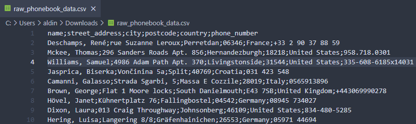
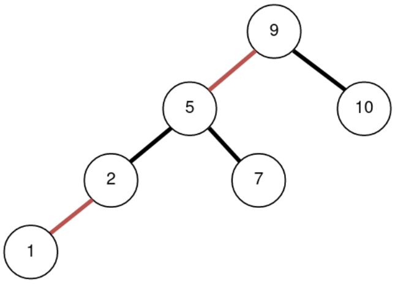
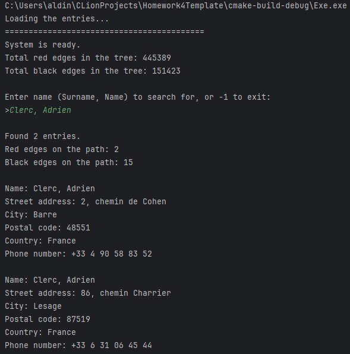
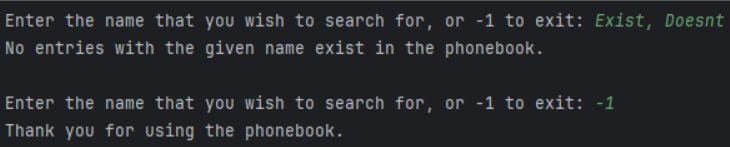
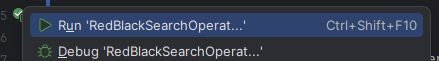
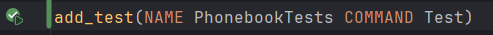
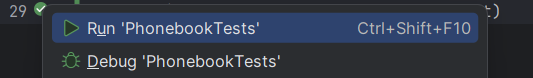
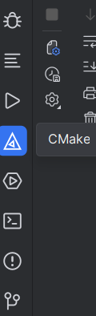
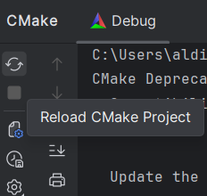

[](https://classroom.github.com/a/V_nq8rgf)
# Homework 4: Improving the phonebook system
**Course**: Data Structures and Algorithms

**Due Date**: _June 24th, 2025 by 23:59_

## The scenario

While the solution with binary search that _you already implemented_ works and the management is happy, you start thinking - this customer database often gets updated; is it not a bit “wasteful” to have to re-sort the file every time that happens, make a new file, and load it into the system? It would be a lot better if you could use a _data structure_ that is _already designed_ for _fast search_ and _retrieval_ operations.

After some thinking, it hits you: a _binary search tree_, or better yet, a **left-leaning red-black tree**. You get to work once again.

As a reminder, here is how the CSV file ([available here](https://drive.google.com/file/d/1Rqk3sXKx79EM9S_K1tKDkZJYAjHqofud/view)) looks like: it contains records for 1,000,000 (one million) active customers, with the **first row** of the CSV file being the column names. Some example data looks like this (notice the ; separators between values):

```
Deschamps, René;rue Suzanne Leroux;Perretdan;06346;France;+33 2 90 37 88 59
Mckee, Thomas;296 Sanders Roads Apt. 856;Hernandezburgh;18218;United States;958.718.0301
Williams, Samuel;4986 Adam Path Apt. 370;Livingstonside;31544;United States;335-608-6185x14031
Jasprica, Biserka;Vončinina 5a;Split;40769;Croatia;031 423 548
Camanni, Galasso;Strada Sgarbi, 5;Massa E Cozzile;28019;Italy;0565913896
Brown, George;Flat 1 Moore locks;South Danielmouth;E43 7SB;United Kingdom;+443069990278
Hövel, Janet;Kühnertplatz 76;Fallingbostel;04542;Germany;08945 734027
Dixon, Laura;013 Craig Throughway;Johnsonberg;46109;United States;834-480-5285
Hering, Luisa;Langering 8/8;Gräfenhainichen;26553;Germany;05971 44694
…
```

## Task 1: Create a search system using a (left-leaning) red-black tree

It is now up to you to take [this large CSV file](https://drive.google.com/file/d/1Rqk3sXKx79EM9S_K1tKDkZJYAjHqofud/view) and make it into a _searchable system_ using **left-leaning red-black trees**.

So, you get to work.

### Part 1: Implement the Entry class and file utils

You should already have the _basic outlines_ for these classes and structs created from **Homework 3**, but if not, here are the descriptions again.

For one, you need to create an **Entry** struct (in `include/Entry.h`) that will hold the relevant information for each user record. The Entry class should contain the user's surname and name, street address, city, postcode, country and phone number. Moreover, the Entry struct should _overload all comparison operators_, so you can use it in a sorting algorithm later.

Next up, you need a way to work with the input file. In the **FileUtils** class (in `src/FileUtils.cpp`) you will need to implement:

- `RedBlackTree read_file(const std::string& file_path, int len)` → given a file path and the total number of lines, _read all lines_ from the file and return _a red-black tree_ containing the **Entry objects**.
- **Note:** To keep things in the text simple, whenever we mention "red-black tree", we are referring to the **left-leaning** variant of it. **Do not use** the "regular" variant.

### Part 2: Implement a (left-leaning) red-black tree

Next up, you need to implement a `Node` struct (in `include\Node.h`) and `RedBlackTree` class in (`src/RedBlackTree.cpp`).

The `Node` struct should have references to the **key** - customer name and surname, and the **values** - a `std::vector` of `Entry` values (feel free to look up how **vectors** work in C++, if you are not sure). Since there are _duplicates_ in the CSV (e.g. _four (4) entries_ for “Clerc, Agnès”), the “values” property should be able to _contain multiple entries_ associated with the same name. Moreover, the Node class should contain references to the _left_ and _right_ children, as well as the _color_ of the node.

In the `src/RedBlackTree.cpp`, implement:

- `std::vector<Entry> get(std::string searchable_name)` → given a customer name, return _a vector of Entries_ that match the name.
  - Example: for “Clerc, Agnès”, return all 4 corresponding values.
  - If an entry with a given name **does not exist**, return _an empty vector_. 
  - The user will search for a name in the format “Surname, Name”.
    - You do not need to support partial matches - it is enough to support the exact name match.
  - The method should also **print out** _how many red and black edges_ were found **on the path** towards the node.

- `void put(std::string searchable_name, Entry entry)` → given a customer name and a value (Entry object), do one of two things:
  - If the name _does not already exist_ in the tree, _add a new node_ with the initial entry in the vector of entries.
  - If the name _already exists_ in the tree, _update the vector of node values_ with the newly added entry.

- `int* count_red_and_black_edges()` that will count _how many black and red edges_ there are **in total** in the tree
  - It should return an array with two values **[black, red]** → how many black and red **edges** there are in total, without the root element (it is black by default, but we will not count it, since there is no “edge” from the root upwards). 

- **any additional methods and properties** which are required for a red-black tree to work (recursive methods, rotations, additional properties, etc.)

#### Explanation: How to count red and black edges
Here is an example red-black tree:


- When counting the **total number** of red and black edges, _simply count all the links between the nodes_. So:
  - black edges: **3**
  - red edges: **2**
- When counting the number of red and black edges **on the way towards a node**:
  - For example, if I am looking for key 1, from the root to key 1 there are:
    - 1 black edge
    - 2 red edges
  - When looking for **key 7**:
    - 1 black edge
    - 1 red edge
  - When looking for **key 10**:
    - 1 black edge
    - 0 red edges
  - etc.

### Part 3: Putting it all together

With all the required classes in place, you can get to work. Implement the search system inside the **main()** method of **src/main.cpp** file.

It is left up to you how to design the "UI / UX" of the system. You are also free to add any additional helper methods if you need them. The main logic of the system should be as follows:

- When the application is started:
    - The _unsorted_ file is loaded into a red-black tree
    - The application prints out the **total number** of _black and red edges_.
- The user is then asked to type in a "_Surname, Name_" combination they want to find, _or_ -1 if they want to close the program.
- If the user types in a name, the application will _try to locate the entry(ies)_ in the red-black tree.
    - If the entry is **found**, the application needs to _print out_:
      - _how many entries_ were found 
      - available details about _each entry_ in a _nicely formatted way_
      - _the number of red and black edges_ encountered until the entry was found.
    - If the entry is _not found_, the application should print out an error message
- When a search is done, the user is prompted to enter a name again. If they enter it, the search process should repeat. If they enter -1, the application should terminate.

Here is an example of how the interaction could look like:



### _(Optional)_ Part 4: Sorting the file using inorder traversal
Use **inorder traversal** to **sort** the entries _by name_. You should create a method which applies inorder traversal to the tree and **saves all entries** into a _new_ **sorted** _CSV file of the same format_ as the original (same order of columns, semicolons as separators).

You **must not** use any other search algorithms or “workarounds” on the tree (e.g. moving all data into a list and sorting that list) - the picking of the next value must be done _explicitly_ using inorder traversal operations on the _tree itself_.

**You DO NOT NEED to upload the sorted file!**

Note that there are **no tests** in the repository for this feature, as it is **optional** (so that it does not mess with other required tests). The best way to "test" out if your solution works is to see if the resulting file is sorted (i.e. equivalent to the sorted file from _last homework_).

## Testing the Application
You can use some of the below **expected values** from the file for testing:

- Clerc, Adrien → 2 entries
  - 2 red edges, 15 black edges
- Sladonja, Mira → 3 entries
  - 3 red edges, 15 black edges
- Dominguez, Lauren → 1 entry
  - 3 red edges, 13 black edges
- Singleton, Matthew → 3 entries
  - 2 red edges, 13 black edges
- Drub, Ismet → 1 entry
  - 4 red edges, 15 black edges
- Smith, John → 101 entries
  - 2 red edges, 14 black edges

To verify the correctness of your implementation, you can run the **unit tests** that come with this repository.

You have two ways to run tests.

1. You can run each test _individually_ by clicking on the "Run" button next to the `TEST_CASE` keywords in the `test/tests.cpp` file.




   There are 4 tests in total, so running each one individually might become tedious, but it is a good way to test out each individual piece of functionality.
2. You can run _all tests at once_ by clicking on the "Run" button next to the `add_test` command in the `CMakeLists.txt` file.




### Q/A: I cannot see the "Run" icon.
If you cannot see the "Run" icon (green play button) for whatever reason next to your tests, the most likely explanation is that your project is _not properly built_.

To re-build your project, click on the `CMake` icon (a triangle with another triangle in it) in the _bottom-left sidebar_ of CLion, followed by `Reload CMake Project`.




After the project is reloaded, you should be able to run your tests (you might need to close and re-open the test file).

If you still cannot run the tests, contact the course professor.

## Implementation Constraints

**You must not:**
- remove any of the methods in the existing files, rename them or change their signatures.

**You should:**
- implement the missing method bodies for the required functionalities, and make sure they return proper output (if any)
- implement any additional helper methods / variables / classes, if you need them for the solution.

**NOTE:** You **do not need to upload** the original and sorted files with your homework; **just upload the homework code**.

---

https://ibu.edu.ba 
